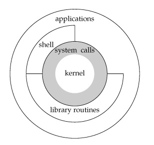

# APUE

## Chapter 1 UNIX基础知识

### 1.1 引言

操作系统为程序提供服务。典型的服务包括：执行新程序，操作文件，分配存储区及获得当前时间等。

### 1.2 UNIX体系结构

严格意义上，操作系统是一种软件，它控制计算机硬件资源，为程序提供运行的环境。通常操作系统被称为kernel，因为它相对较小，并且位于环境的核心。



广义上，操作系统包括了内核和一些其它软件，这些软件使得计算机能够发挥作用，并具有自己的特性。

### 1.3 登录

口令文件(/etc/passwd)用于保存用户信息。

格式：account:password:UID:GID:comment field:directory:shell （帐号:密码:用户ID:组ID:注释性描述:目录:shell）

字段描述:
* account  使用者在系统中的名字，它不能包含大写字母.
* password  加密的用户密码，目前所有系统已将加密口令移道另一个文件中。
* UID    用户 ID 数。
* GID    用户的主要组 ID 数。
* comment field  这字段是可选的，通常为了存放信息目的而设的． 通常，它包含了用户的全名。
* directory 用户的 $HOME 目录.
* shell   登录时运行的程序（如果空的，使用 /bin/sh).  如果设为不存在的执行（程序），用户不能通过 login(1) 登录.

### 1.4 文件和目录

UNIX文件系统是目录和文件的一种层次结构，起点为根目录(/)。

目录(directory)是一个包含目录项的文件。逻辑上可以认为每个目录项都包含一个文件名和说明该文件属性的信息。文件属性是指文件类型，大小，所有者，文件权限以及文件最后的修改时间等。

**文件名命名规范：POSIX.1 推荐文件名限制在以下字符集内：字母(a~z, A~Z), 数字(0~0), 句点(.), 短横线(-)和下划线(_)。**


```c
#include <dirent.h> // DIR 和 dirent结构体定义，opendir, readdir, closedir定义
#incluce <stdio.h>

int main(int argc, char * argv[])
{
    DIR *dp;
    struct dirent *dirp;
    
    if (argc != 2)
        printf("usage: ls directory_name\n");
    
    if ((dp = opendir(argv[1])) != NULL)
    {
        while ((dirp = readdir(dp)) != NULL)
            printf("%s\t%d\n", dirp->d_name, dirp->d_type);
        
        closedir(dp);
    }
    else
    {
        printf("can't open %s\n", argv[1])
    }
    
	return 0;
}
```

### 1.5 输入和输出

**文件描述符**：小的非负整数，内核用来表示一个特定进程正在访问的文件。在读写文件时，可以使用这个文件描述符。

