# C语言结构体（struct）

## 1 结构体的定义

结构体(struct)是由一系列具有相同类型或不同类型的数据构成的数据集合，也叫结构。

结构体和其他类型基础数据类型一样，例如int类型，char类型只不过结构体可以做成你想要的数据类型。以方便日后的使用。

在实际项目中，结构体是大量存在的。研发人员常使用结构体来封装一些属性来组成新的类型。由于C语言无法操作数据库，所以在项目中通过对结构体内部变量的操作将大量的数据存储在内存中，以完成对数据的存储和操作。

在实际问题中有时候我们需要几种数据类型一起来修饰某个变量。

例如一个学生的信息就需要学号（字符串），姓名（字符串），年龄（整形）等等。

这些数据类型都不同但是他们又是表示一个整体，要存在联系，那么我们就需要一个新的数据类型。

——结构体，它就将不同类型的数据存放在一起，作为一个整体进行处理。

结构体在函数中的作用不是简便，其最主要的作用就是封装。封装的好处就是可以再次利用。让使用者不必关心这个是什么，只要根据定义使用就可以了。

结构体的大小不是结构体元素单纯相加就行的，因为我们现在主流的计算机使用的都是32Bit字长的CPU，对这类型的CPU取4个字节的数要比取一个字节要高效，也更方便。所以在结构体中每个成员的首地址都是4的整数倍的话，取数据元素时就会相对更高效，这就是内存对齐的由来。每个特定平台上的编译器都有自己的默认“对齐系数”(也叫对齐模数)。程序员可以通过预编译命令[#pragma pack(n)](./#pragmapack.md)，n=1,2,4,8,16来改变这一系数，其中的n就是你要指定的“对齐系数”。

### 1.1 规则

1. 数据成员对齐规则：结构(struct)(或联合(union))的数据成员，第一个数据成员放在offset为0的地方，以后每个数据成员的对齐按照[#pragma pack](./#pragmapack.md)指定的数值和这个数据成员自身长度中，比较小的那个进行。

2. 结构(或联合)的整体对齐规则：在数据成员完成各自对齐之后，结构(或联合)本身也要进行对齐，对齐将按照[#pragma pack](./#pragmapack.md)指定的数值和结构(或联合)最大数据成员长度中，比较小的那个进行。

3. 结合1、2可推断：当[#pragma pack](./#pragmapack.md)的n值等于或超过所有数据成员长度的时候，这个n值的大小将不产生任何效果。

在C语言中，可以定义结构体类型，将多个相关的变量包装成为一个整体使用。在结构体中的变量，可以是相同、部分相同，或完全不同的数据类型。在C语言中，结构体不能包含函数。在面向对象的程序设计中，对象具有状态（属性）和行为，状态保存在成员变量中，行为通过成员方法（函数）来实现。C语言中的结构体只能描述一个对象的状态，不能描述一个对象的行为。在C++中，考虑到C语言到C++语言过渡的连续性，对结构体进行了扩展，C++的结构体可以包含函数，这样，C++的结构体也具有类的功能，与class不同的是，结构体包含的函数默认为public，而不是private。

## 2 结构体声明

```C
//声明一个结构体
struct book
{
    char title[MAXTITL];//一个字符串表示的titile 题目 ；
    char author[MAXAUTL];//一个字符串表示的author作者 ；
    float value;//一个浮点型表示的value价格；
};//注意分号不能少，这也相当于一条语句；
```

这个声明描述了一个由两个字符数组和一个float变量组成的结构体。

但是注意，它并没有创建一个实际的数据对象，而是描述了一个组成这类对象的元素。

因此，我们有时候也将结构体声明叫做模板，因为它勾勒出数据该如何存储，并没有实例化数据对象。

### 2.1 下面介绍一下上面的结构体声明

1. 首先使用关键字struct，它表示接下来是一个结构体。

2. 后面是一个可选的标志（book），它是用来引用该结构体的快速标记。

    因此我们以后就可以这样创建数据对象
    struct book library；//把library设为一个可以使用book结构体的结构体变量，则library这个变量就包含了其book结构体中的所有元素

3. 接下来就是一个花括号，括起了结构体成员列表，及每个成员变量，使用的都是其自己的声明方式来描述，用分号来结束描述；

    例如：char title[MAXTITL];字符数组就是这样声明的，用分号结束；
    注意：其中每个成员可以使用任何一种C数据结构甚至是其他的结构体，也是可以的；

4. 在结束花括号后的分号表示结构体设计定义的结束。

**关于其struct声明的位置，也就是这段代码要放到哪里。同样这也是具有作用域的。**

这种声明如果放在任何函数的外面，那么则可选标记可以在本文件中，该声明的后面的所有函数都可以使用。

如果这种声明在某个函数的内部，则它的标记只能在内部使用，并且在其声明之后；

**关于我们不断说的，标记名是可选的，那么我们什么时候可以省略，什么时候一定不能省略呢？**

如果是上面那种声明定义的方法，并且想在一个地方定义结构体设计，而在其他地方定义实际的结构体变量，那么就必须使用标记；

在声明的时候就定义结构体变量时，可以省略，这种结构体的设计是一次性的。

**一般格式就是：**

struct 结构体名(也就是可选标记名）{    成员变量；}；//使用分号表示定义结束。

## 3 C语言结构体定义的三种方式

### 3.1 最标准的方式

```C
#include <stdio.h>
struct student //结构体类型的说明与定义分开。声明
{
    int age;  /*年龄*/
    float score; /*分数*/
    char sex;   /*性别*/
};

int main ()
{
    struct student a={ 20,79,'f'}; //定义
    printf("年龄：%d 分数：%.2f 性别：%c\n", a.age, a.score, a.sex );

    return 0;
}
```

### 3.2 不环保的方式

```C
#include <stdio.h>
struct student /*声明时直接定义*/
{
    int age;  /*年龄*/
    float score;  /*分数*/
    char sex;   /*性别*/
    /*这种方式不环保，只能用一次*/
} a={21,80,'n'};

int main ()
{
    printf("年龄：%d 分数：%.2f 性别：%c\n", a.age, a.score, a.sex );
}
```

### 3.3 最奈何人的方式

```C
#include <stdio.h>

struct   //直接定义结构体变量，没有结构体类型名。这种方式最烂
{
    int age;
    float score;
    char sex;
} t={21,79,'f'};

int main ()
{
    printf("年龄：%d 分数：%f 性别：%c\n", t.age, t.score, t.sex);

    return 0;
}

```

## 4 定义结构体变量

之前我们结构体类型的定义（结构体的声明）只是告诉编译器该如何表示数据，但是它没有让计算机为其分配空间。

我们要使用结构体，那么就需要创建变量，也就是结构体变量；

创建一个结构体变量；

```C
struct book library；
```

看到这条指令，编译器才会创建一个结构体变量library，此时编译器才会按照book模板为该变量分配内存空间，并且这里存储空间都是以这个变量结合在一起的。

这也是后面访问结构体变量成员的时候，我们就要用到结构体变量名来访问。

### 4.1 分析

**struct book的作用：**

在结构体声明中，struct book所起到的作用就像int，，，，等基础数据类型名作用一样。

```C
struct book s1，s2，*ss；
```

定义两个struct book结构体类型的结构体变量，还定义了一个指向该结构体的指针，其ss指针可以指向s1，s2，或者任何其他的book结构体变量。

其实；

```C
struct book library；
```

等效于；

```C
struct book{
    char …
    ….
    …..
}librar；
```

这两种是等效的，只是第一种可以减少代码的编写量；

**现在还是回到刚才提及的那个问题，可选标志符什么时候可以省略;**

**其一；**

```C
struct
{
    char title[MAXTITL]; 
    char author[MAXAUTL];
    float value；
}library;
```

//注意这里不再是定义声明结构体类型，而是直接创建结构体变量了，这个编译器会分配内存的；

//这样的确可以省略标识符也就是结构体名，但是只能使用一次；因为这是；声明结构体的过程和定义结构体变量的过程和在了一起；并且个成员变量没有初始化的；

//如果你想多次使用一个结构体模块，这样子是行不通的；

**其二；**

用typedef定义新类型名来代替已有类型名，即给已有类型重新命名；

一般格式为；typedef 已有类型 新类型名；

```C
typedef int Elem; 
typedef struct{
    int date;
    .....
    .....
}STUDENT;
STUDENT stu1,stu2;
```

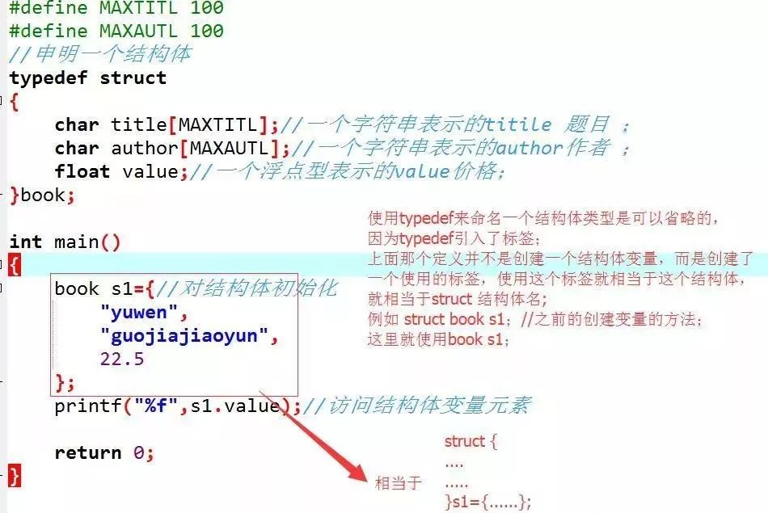

### 4.2 总结一下关于结构体变量的定义

1. 先定义结构体类型后再定义结构体变量；

    格式为；struct 结构体名 变量名列表；

    ```C
    struct book s1，s2，*ss；//注意这种之前要先定义结构体类型后再定义变量；
    ```

2. 在定义结构体类型的同时定义结构体变量；

    格式为；

    ```C
    struct 结构体名
    {
        成员列表；
    }变量名列表；//这里结构体名是可以省的，但尽量别省；

    struct book
    {
        char title[MAXTITL];//一个字符串表示的titile 题目 ；
        char author[MAXAUTL];//一个字符串表示的author作者 ；
        float value;//一个浮点型表示的value价格；
    }s1，s2;
    ```

### 4.3 直接定义结构体类型变量，就是第二种中省略结构体名的情况

这种方式不能指明结构体类型名而是直接定义结构体变量，并且在值定义一次结构体变量时适用，无结构体名的结构体类型是无法重复使用的。

也就是说，后面程序不能再定义此类型变量了，除非再写一次重复的struct。

## 5 对于结构体变量的初始化

```C
int a = 0；
int array[4] = {1,2,3,4};//每个元素用逗号隔开
```

回忆一下数组初始化问题；

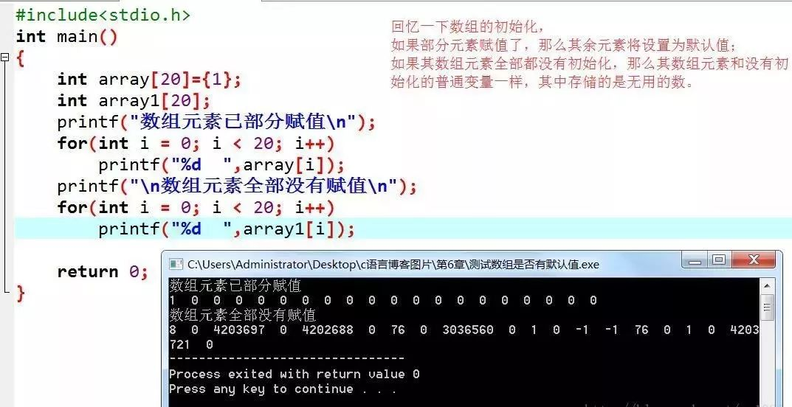

**再回到结构体变量的初始化吧**

关于结构体变量的初始化与初始化数组类似；

也是使用花括号括起来，用逗号分隔的初始化好项目列表，注意每个初始化项目必须要和要初始化的结构体成员类型相匹配。

```C
struct book s1={//对结构体初始化 
        "yuwen",//title为字符串 
        "guojiajiaoyun",//author为字符数组 
        22.5    //value为flaot型 
    };
//要对应起来，用逗号分隔开来，与数组初始化一样；
```

加入一点小知识；关于结构体初始化和存储类时期的问题；如果要初始化一个具有静态存储时期的结构体，初始化项目列表中的值必须是常量表达式；

注意如果在定义结构体变量的时候没有初始化，那么后面就不能全部一起初始化了；意思就是：

```C
/////////这样是可以的，在定义变量的时候就初始化了；
struct book s1={//对结构体初始化 
        "guojiajiaoyun",//author为字符数组 
          "yuwen",//title为字符串 
          22.5
    };
/////////这种就不行了，在定义变量之后，若再要对变量的成员赋值，那么只能单个赋值了；
struct book s1;
    s1={ 
         "guojiajiaoyun",//author为字符数组 
          "yuwen",//title为字符串 
          22.5  
};//这样就是不行的，只能在定义的时候初始化才能全部赋值，之后就不能再全体赋值了，只能单个赋值；

s1.title = "yuwen";........//单个赋值；
```

对于结构体的指定初始化；

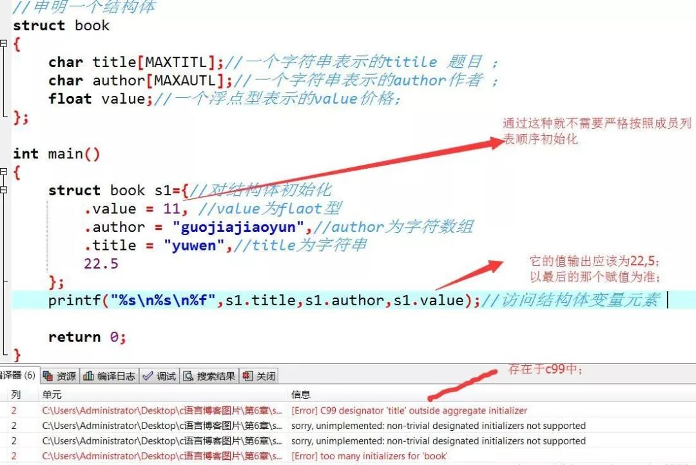

## 6 访问结构体成员

结构体就像一个超级数组，在这个超级数组内，一个元素可以是char类型，下个元素就可以是flaot类型，再下个还可以是int数组型，这些都是存在的。

在数组里面我们通过下标可以访问一个数组的各个元素，那么如何访问结构体中的各个成员呢？

用结构成员运算符点（.）就可以了；

结构体变量名.成员名;

注意，点其结合性是自左至右的，它在所有的运算符中优先级是最高的；

例如，s1.title指的就是s1的title部分，s1.author指的就是s1的author部分,s1.value指的就是s1的value部分。

然后就可以像字符数组那样使用s1.title,像使用float数据类型一样使用s1.value；

注意，s1；虽然是个结构体，但是s1.value却是float型的。

因此s1.value就相当于float类型的变量名一样，按照float类型来使用；

例如；printf(“%s\n%s\n%f”,s1.title,s1.author,s1.value);//访问结构体变量元素

注意scanf(“%d”,&s1.value); 这语句存在两个运算符，&和结构成员运算符点。

按照道理我们应该将（s1。value括起来，因为他们是整体，表示s1的value部分）但是我们不括起来也是一样的，因为点的优先级要高于&。

**如果其成员本身又是一种结构体类型，那么可以通过若干个成员运算符，一级一级的找到最低一级成员再对其进行操作；**

结构体变量名.成员.子成员………最低一级子成员;

```C
struct date
{
    int year;
    int month;
    int day;
};
struct student
{
    char name[10];
    struct date birthday;
}student1;
//若想引用student的出生年月日，可表示为；student.brithday.year；
brithday是student的成员；year是brithday的成员；
```

### 6.1 整体与分开

可以将一个结构体变量作为一个整体赋值给另一相同类型的结构体变量，可以到达整体赋值的效果；这个成员变量的值都将全部整体赋值给另外一个变量；

不能将一个结构体变量作为一个整体进行输入和输出；在输入输出结构体数据时，必须分别指明结构体变量的各成员；

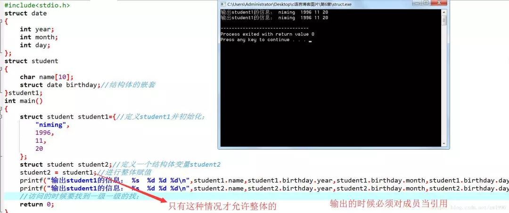

小结：除去“相同类型的结构体变量可以相互整体赋值”外，其他情况下，不能整体引用，只能对各个成员分别引用；

## 7 结构体长度

### 7.1 数据类型的字节数

#### 7.1.1 16位编译器

char ：1个字节

char*(即指针变量): 2个字节

short int : 2个字节

int：  2个字节

unsigned int : 2个字节

float:  4个字节

double:   8个字节

long:   4个字节

long long:  8个字节

unsigned long:  4个字节

#### 7.1.2 32位编译器

char ：1个字节

char*（即指针变量）: 4个字节（32位的寻址空间是2^32, 即32个bit，也就是4个字节。同理64位编译器）

short int : 2个字节

int：  4个字节

unsigned int : 4个字节

float:  4个字节

double:   8个字节

long:   4个字节

long long:  8个字节

unsigned long:  4个字节

那么，下面这个结构体类型占几个字节呢？

```C
typedef struct
{
  char addr;
  char name;
  int  id;
}PERSON;
```

通过printf("PERSON长度=%d字节\n",sizeof(PERSON));可以看到结果：

PERSON长度=8字节

## 8 结构体字节对齐

通过下面的方式，可以清楚知道为什么是8字节。

1、定义20个char元素的数组

```C
char ss[20]={0x10,0x11,0x12,0x13,0x14,0x15,0x16,0x17,0x18,0x19,0x20,0x21,0x22,0x23,0x24,0x25,0x26,0x27,0x28,0x29};
```

2、定义结构体类型的指针ps指向ss数组

```C
PERSON *ps=(PERSON *)ss;
```

3、打印输出各个成员

```C
printf("0x%02x,0x%02x,0x%02x\n",ps->addr,ps->name,ps->id);printf("PERSON长度=%d字节\n",sizeof(PERSON));
```

输出内容：
0x10, 0x11, 0x17161514
PERSON长度=8字节

可以看到addr和name都只占一个字节，但是未满4字节，跳过2字节后才是id的值，这就是4字节对齐。结构体成员有int型，会自动按照4字节对齐。

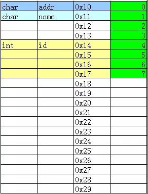

把结构体成员顺序调换位置，

```C
typedef struct
{
  char addr;
  int  id;
  char name;
}PERSON;
```

输出内容：
0x10, 0x18, 0x17161514
PERSON长度=12字节

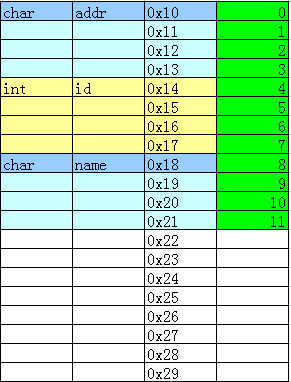

按照下面的顺序排列：

```C
typedef struct
{  
  int  id;
  char addr;
  char name;
}PERSON;
```

输出内容：
0x14, 0x15, 0x13121110
PERSON长度=8字节

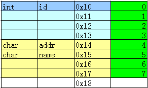

如果全部成员都是char型，会按照1字节对齐，即

```C
typedef struct
{  
  char addr;
  char name;  
  char  id;
}PERSON;
```

输出内容：
0x10, 0x11, 0x12
PERSON长度=3字节

## 9 结构体嵌套

结构体嵌套结构体方式：

```C
typedef struct
{  
  char addr;
  char name;  
  int  id;
}PERSON;

typedef struct
{  
  char age;
  PERSON  ps1;
}STUDENT;
```

先定义结构体类型PERSON，再定义结构体STUDENT，PERSON作为它的一个成员。

按照前面的方法，打印各成员的值。

1、定义STUDENT 指针变量指向数组ss

```C
STUDENT *stu=(STUDENT *)ss;
```

2、打印输出各成员和长度

```C
printf("0x%02x,0x%02x,0x%02x,0x%02x\n",stu->ps1.addr,stu->ps1.name,stu->ps1.id,stu->age);
printf("STUDENT长度=%d字节\n",sizeof(STUDENT));
```

输出内容：
0x14, 0x15, 0x21201918, 0x10
PERSON长度=12字节

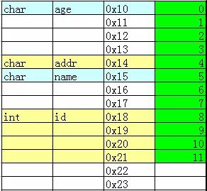

调换STUDENT成员顺序，即

```C
typedef struct
{  
  PERSON  ps1;
  char age;
}STUDENT;
```

输出内容：
0x10, 0x11, 0x17161514, 0x18
PERSON长度=12字节

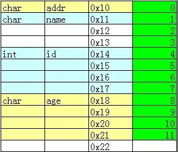

结构体嵌套其实没有太意外的东西，只要遵循一定规律即可：

```C
//对于“一锤子买卖”，只对最终的结构体变量感兴趣，其中A、B也可删，不过最好带着  
struct A{
    struct B{  
        int c;  
    } b;  
} a;
//使用如下方式访问：
a.b.c = 10;
```

特别的,可以一边定义结构体B，一边就使用上：

```C
 struct A{  
    struct B{  
            int c;  
    }b;  

    struct B sb;
}a;  
```

使用方法与测试：

```C
a.b.c = 11;  
printf("%d\n",a.b.c);  
a.sb.c = 22;  
printf("%d\n",a.sb.c);
```

结果无误。

但是如果嵌套的结构体B是在A内部才声明的，并且没定义一个对应的对象实体b，这个结构体B的大小还是不算进结构体A中。

## 10 占用内存空间

struct结构体，在结构体定义的时候不能申请内存空间，不过如果是结构体变量，声明的时候就可以分配——两者关系就像C++的类与对象，对象才分配内存（不过严格讲，作为代码段，结构体定义部分“.text”真的就不占空间了么？当然，这是另外一个范畴的话题）。

结构体的大小通常（只是通常）是结构体所含变量大小的总和。

### 10.1 下边说说不通常的情况

对于结构体中比较小的成员，可能会被强行对齐，造成空间的空置，这和读取内存的机制有关，为了效率。通常32位机按4字节对齐，小于的都当4字节，有连续小于4字节的，可以不着急对齐，等到凑够了整，加上下一个元素超出一个对齐位置，才开始调整，比如3+2或者1+4，后者都需要另起（下边的结构体大小是8bytes），相关例子就多了，不赘述。

```C
struct s  
{  
    char a;  
    short b;  
    int c;  
}
```

相应的，64位机按8字节对齐。不过对齐不是绝对的，用[#pragma pack()](./#pragmapack.md)可以修改对齐，如果改成1，结构体大小就是实实在在的成员变量大小的总和了。

和C++的类不一样，结构体不可以给结构体内部变量初始化。

如下，为错误示范：

```C
#include<stdio.h>  
//直接带变量名
struct stuff{  
//      char job[20] = "Programmer";  
//      char job[];  
//      int age = 27;  
//      float height = 185;  
};
```

PS：结构体的声明也要注意位置的，作用域不一样。

C++的结构体变量的声明定义和C有略微不同，说白了就是更“面向对象”风格化，要求更低。

## 11 为什么有些函数的参数是结构体指针型

如果函数的参数比较多，很容易产生“重复C语言代码”，例如：

```C

int get_video(char **name, long *address, int *size, time_t *time, int *alg)
{
    ...
}
int handle_video(char *name, long address, int size, time_t time, int alg)
{
    ...
}
int send_video(char *name, long address, int size, time_t time, int alg)
{
    ...
}
```

上述C语言代码定义了三个函数：get_video() 用于获取一段视频信息，包括：视频的名称，地址，大小，时间，编码算法。

然后 handle_video() 函数根据视频的这些参数处理视频，之后 send_video() 负责将处理后的视频发送出去。下面是一次调用：

```C
char *name = NULL;
long address;
int size, alg;
time_t time;

get_video(&name, &address, &size, &time, &alg);
handle_video(name, address, size, time, alg);
send_video(name, address, size, time, alg);
```

从上面这段C语言代码来看，为了完成视频的一次“获取”——“处理”——“发送”操作，C语言程序不得不定义多个变量，并且这些变量需要重复写至少三遍。

虽说C语言程序的代码风格因人而异，但是“重复的代码”永远是应尽力避免的。不管怎么说，每次使用这几个函数，都需要定义很多临时变量，总是非常麻烦的。所以，这种情况下，完全可以使用C语言的结构体语法：

```C

struct video_info{
    char *name;
    long address;
    int size;
    int alg;
    time_t time;
};
```

定义好 video_info 结构体后，上述三个C语言函数的参数可以如下写，请看：

```C
int get_video(struct video_info *vinfo)
{
    ...
}
int handle_video(struct video_info *vinfo)
{
    ...
}
int send_video(struct video_info *vinfo)
{
    ...
}

```

修改后的C语言代码明显精简多了，在函数内部，视频的各个信息可以通过结构体指针 vinfo 访问，例如：

```C
printf("video name: %s\n", vinfo->name);
long addr = vinfo->address;
int size = vinfo->size;
```

事实上，使用结构体 video_info 封装视频信息的各个参数后，调用这几个修改后的函数也是非常简洁的：

```C
struct video_info vinfo = {0};

get_video(&vinfo);
handle_video(&vinfo);
send_video(&vinfo);
```

从上述C语言代码可以看出，使用修改后的函数只需定义一个临时变量，整个代码变得非常精简。

修改之前的 handle_video() 和 send_video() 函数原型如下：

```C
int handle_video(char *name, long address, int size, time_t time, int alg);
int send_video(char *name, long address, int size, time_t time, int alg);
```

根据这段C语言代码，我们知道 handle_video() 和 send_video() 函数只需要读取参数信息，并不再修改参数，那为什么使用结构体 video_info 封装数据，修改后的 handle_video() 和 send_video() 函数参数是 struct video_info  *指针型呢?

```C
int handle_video(struct video_info *vinfo);
int send_video(struct video_info *vinfo);
```

既然 handle_video() 和 send_video() 函数只需要读取参数信息，那我们就无需再使用指针型了呀？的确如此，这两个函数的参数直接使用 struct video_info 型也是可以的：

```C
int handle_video(struct video_info vinfo)
{
    ...
}
int send_video(struct video_info vinfo)
{
    ...
}
```

似乎这种写法和使用struct video_info  *指针型参数的区别，无非就是函数内部访问数据的方式改变了而已。但是，如果读者能够想到我们之前讨论过的C语言函数的“栈帧”概念，应该能够发现，使用指针型参数的 handle_video() 和 send_video() 函数效率更好，开销更小。

## 11 嵌入式开发中，C语言位结构体用途详解

在嵌入式开发中，经常需要表示各种系统状态，位结构体的出现大大方便了我们，尤其是在进行一些硬件层操作和数据通信时。但是在使用位结构体的过程中，是否深入思考一下它的相关属性？是否真正用到它的便利性，来提高系统效率？

下面将进行一些相关实验（这里以项目开发中的实际代码为例）：

### 11.1 位结构体类型设计

```C
//data structure except for number structure  
typedef struct symbol_struct  
{  
    uint_32 SYMBOL_TYPE    :5;  //data type,have the affect on "data display type"
    uint_32 reserved_1     :4;  
    uint_32 SYMBOL_NUMBER  :7;  //effective data number in one element  
    uint_32 SYMBOL_ACTIVE  :1;  //symbol active status  
    uint_32 SYMBOL_INDEX   :8;  //data index in norflash,result is related to "xxx_BASE_ADDR"
    uint_32 reserved_2     :8;  
}SYMBOL_STRUCT,_PTR_ SYMBOL_STRUCT_PTR;
```

分析：这里定义了一个位结构体类型SYMBOL_STRUCT，那么用该类型定义的变量都哪些属性呢？

看下面运行结果：

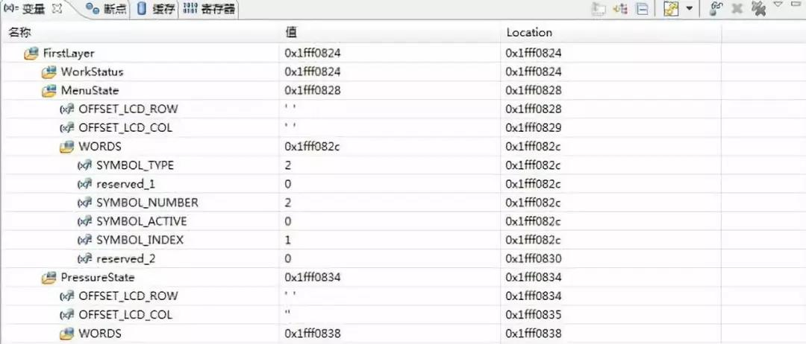

WORDS是定义的另一个外层类型定义封装，可以把它当作变量来看待。WORDS变量里前5个数据域的地址都是0x1ffff082c，而reserved_2的地址0x1fff0830,紧接着的PressureState变量是0x1fff0834。

开始以为：reserved_1和SYMBOL_TYPE不在一个地址上，因为他们5+4共9位，超过了1个字节地址，但实际他们共用首地址了；而且reserved_2只定义了8位，竟然实际占用了4个字节（0x1fff0834 - 0x1fff0830），我本来是想让他占用1个字节的。WORDS整体占了8个字节（0x1fff0834 - 0x1fff082c），设计时分析占用5个字节

（SYMBOL_TYPE 1个；reserved_1 1个；SYMBOL_NUMBER+SYMBOL_ACTIVE 1个；SYMBOL_INDEX 1个；reserved_2 1个）。

uint_32  reserved_2   : 8;  占用4个字节，估计是uint_32在起作用，而这里写的8位，只是我使用的有效位数，另外24位空闲，如果在下面再定义一个uint_32 reserved_3   : 8，地址也是一样的，都是以uint_32为单位取地址。

同理，上面的5个变量，共用一个地址就不足为奇了。而且有效位的分配不是连续进行的，例如SYMBOL_TYPE+reserved_1 共9位，超过了一个字节，索性系统就分配两个字节给他们，每人一个；SYMBOL_NUMBER+SYMBOL_ACTIVE 共8位，一个字节就能搞定。

### 11.2 修改数据结构，验证上述猜想

```C
//data structure except for number structure  
typedef struct symbol_struct  
{  
    uint_8 SYMBOL_TYPE    :5;  //data type,have the affect on "data display type"
    uint_8 reserved_1     :4;
    uint_8 SYMBOL_NUMBER  :7;  //effective data number in one element
    uint_8 SYMBOL_ACTIVE  :1;  //symbol active status
    uint_8 SYMBOL_INDEX   :8;  //data index in norflash,result is related to "xxx_BASE_ADDR"
    uint_8 reserved_2     :8;
}SYMBOL_STRUCT,_PTR_ SYMBOL_STRUCT_PTR;
```

地址数据如下：


当换成uint_8后，可以看到地址空间占用大大减小，reserved_2只占用1个字节(0x1fff069f - 0x1fff069e)，其他变量也都符合上面的结论猜想。但是，注意看上面黄色和红色的语句，总感觉有些勉强，那么我又会想，前两个变量数据域是9位，那么他们实际上是不是真正的独立呢？虽然在uint_8上面他们是不同的地址，在uint_32的时候是不是也是不同的地址空间呢？

### 11.3 分析结构体内部的数据域是否连续，看下图及结果

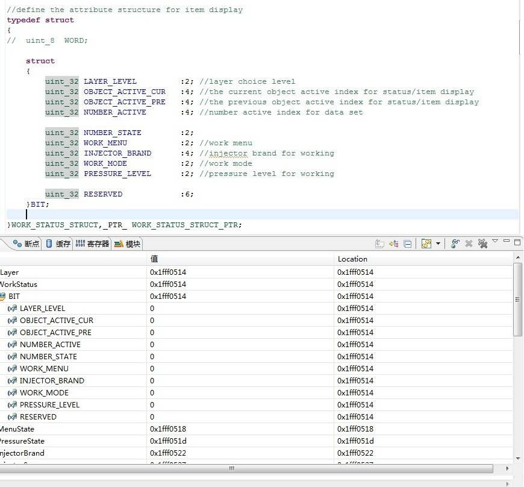

本来假设： 由前2次试验的结论，一共占用8个字节，节空间占用：(2+4)+(4+4)+(2+2+4)+(2+2)+(6)。可是，实际效果并不是想的那样。实际只占用了4个字节，系统并没有按照预想的方式，为RESERVED变量分配4个字节。

**分析：**

这些数据域，整体相加一共32位，占用4个字节(不考虑数据对齐问题)。而实际确实是占用了4个字节，唯一的原因就是：这些数据域以紧凑的方式链接，没有任何空闲位。实际是不是这样呢？

**看下图和结果：**

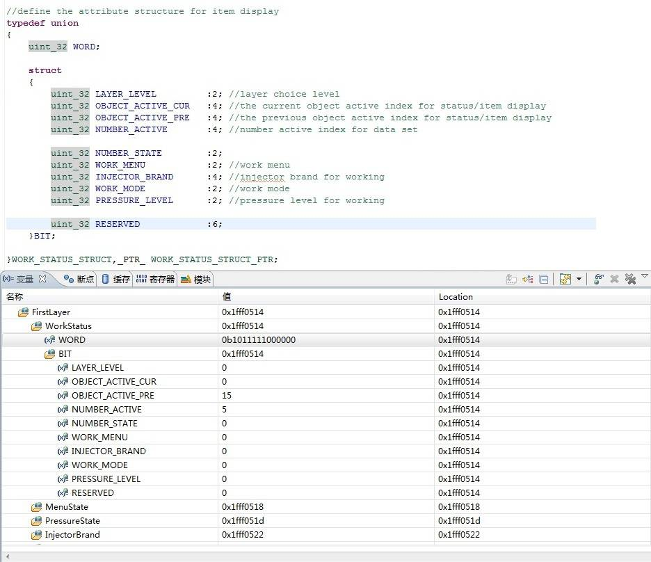

里为了验证是否紧凑链接，用到了一个union数据，后面会讲到用union不会对数据组织方式有任何影响，看实际与上次的一样，也能分析出来。

主要是分析第2和第3个数据域是否紧密链接的。OBJECT_ACTIVE_PRE赋值0b00001111，NUMBER_ACTIVE赋值0b00000101，其他变量都是0，看到WORD数值0b1011111000000。分析WORD数据，可以看到这款MCU还是小端格式(高位数据在高端，低位数据在低端，这里不对大小端进行讨论)，断开数据变成(0)10111 11000000，正好是0101+1111，OBJECT_ACTIVE_PRE数据域，跨越了两个字节，并不是刚开始设想的那样。这就印证了上面的紧密链接的结论，也符合数据结果输出。

### 11.4 再次实验，分析数据是否紧密链接，看下图和结果

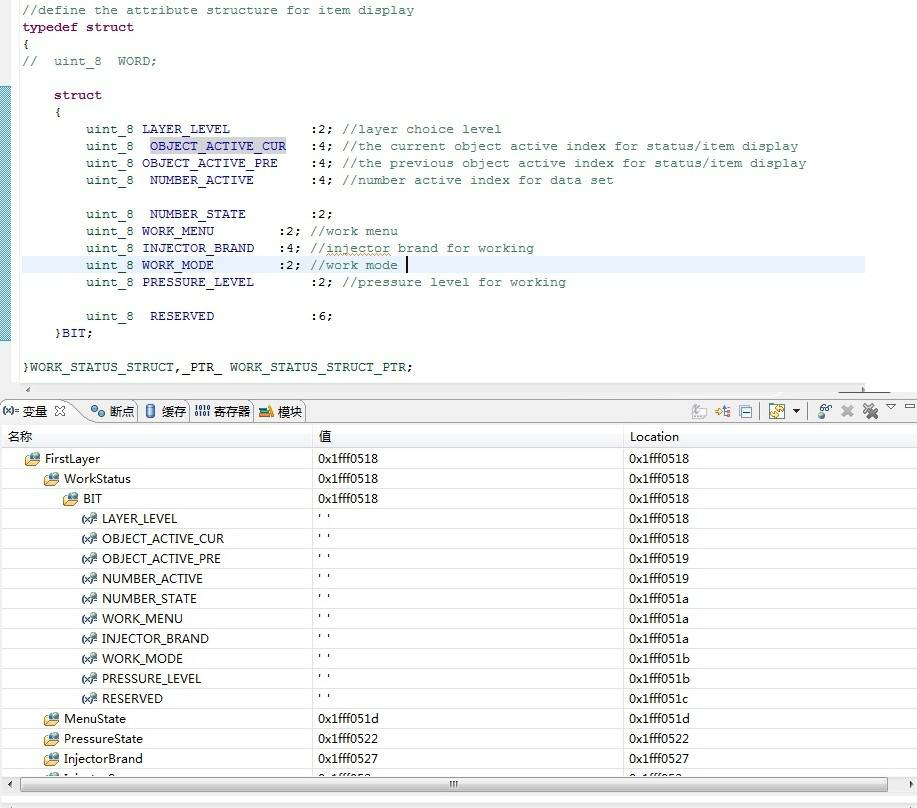

可以看到，RESERVED数据域已经不再属于4个地址空间内了(0x1fff0518 - 0x1fff051b)，但是他们整体加起来还是32个位域。这说明数据中间肯定有“空隙”存在了，空隙在哪？看一下NUMBER_STATE，如果紧密的话它应该跟NUMBER_ACTIVE在同一个字节地址上，可是他们并不在一块，“空隙”就存在这里。

这两个结构体有什么不一样？数据类型不一致，一个是uint_32，一个是uint_8。综上所述：数据类型影响的是编译器在分配物理空间时的大小单位，uint_32是以4个字节为单位，而后面的位域则是指在已经分配好的物理空间内部再紧凑的方式分配数据位，当物理空间不能满足位域时，那么系统就再次以一定大小单位进行物理空间分配，这个单位就是上面提到的uint_8或者uint_32。

举例：上面uint_32时，这些位域不管是不是在一个字节地址上，如果能够紧凑的分配在一个4字节空间大小上，就直接紧凑分配。如果不能则继续分配(总空间超过4字节)，则再次以4字节空间分配，并把新的位域建立在新的地址空间上(条目1上的就是)。当uint_8时，很明显如果位域不能紧凑的放在一个字节空间上，那么就从新分配新的1字节空间大小，道理是一样的。

### 11.5 结构体组合、共用体组合是否影响上述结论

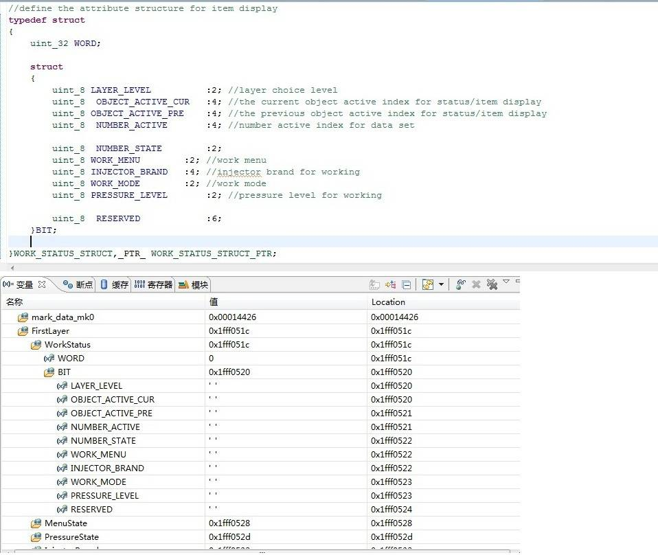

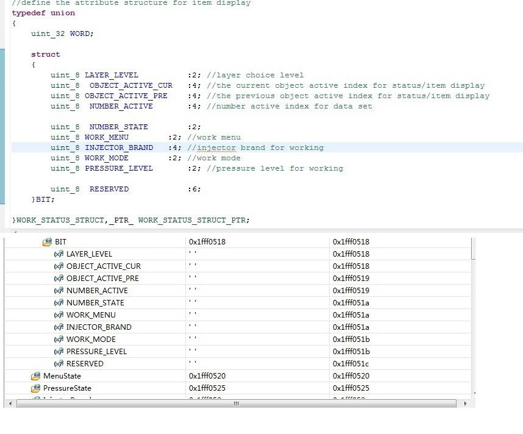

可以看到，系统并没有因为位结构体上面有uint_32的4字节变量或者共用体类型，就改变分配策略把位域都挤到4字节之内，看来他们是没有什么实质性联系的。这里把uint_32改成uint_8，或者把位结构体也替换掉，经试验证明，都是没有任何影响的。

**总结：**

1. 在操作位结构体时，要关注变量的位域是否在一个变量类型（uint_32或者uint_8）上，判断占用空间大小

2. 除了位域，还要关注变量定义类型，因为编译器空间分配始终是按类型分配的，位域只是指出了有效位(小于类型占用空间)，而且如果位域大于类型空间，编译器直接报错（如 uint_8  test  :15，可自行实验）。

3. 这两个因素都影响变量占用空间大小，具体可以结合调试窗口，通过地址分配分析判断

4. 最重要的一点：上面的所有结果，都是基于我自己的CodeWarrior10.2和MQX3.8分析出来的，不同的编译环境和操作系统，都可能会有不同的结果；而且即便是环境相同，编译器的配置和优化选项都有可能影响系统处理结果。结论并不重要，主要想告诉大家这一块隐藏陷阱，在以后处理类似问题时，要注意分析避让并掌握方法。
