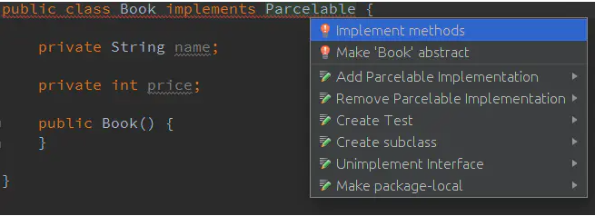

# AIDL详解

原文:
1. [Android：学习AIDL，这一篇文章就够了(上)](https://www.jianshu.com/p/a8e43ad5d7d2)
2. [Android：学习AIDL，这一篇文章就够了(下)](https://www.jianshu.com/p/0cca211df63c)


## 1. 概述

AIDL是一个缩写，全称是Android Interface Definition Language，也就是Android接口定义语言。是的，首先我们知道的第一点就是：AIDL是一种语言。既然是一种语言，那么相应的就很自然的衍生出了一些问题：

* 为什么要设计出这么一门语言？

* 它有哪些语法？

* 我们应该如何使用它？

* 再深入一点，我们可以思考，我们是如何通过它来达到我们的目的的？

* 更深入一点，为什么要这么设计这门语言？会不会有更好的方式来实现我们的目的？


接下来，我们就一步步的来解答上面的这些问题。

ps：

**1，**在研究AIDL相关的东西之前，一些必要的知识储备是要有的。一方面是关于Android中service相关的知识，要了解的比较通透才行，关于这方面的东西可以参考 [Android中的Service：默默的奉献者 (1)](https://link.jianshu.com?t=http://blog.csdn.net/luoyanglizi/article/details/51586437)，[Android中的Service：Binder，Messenger，AIDL（2）](https://link.jianshu.com?t=http://blog.csdn.net/luoyanglizi/article/details/51594016) 这两篇博文。另一方面是关于Android中序列化的相关知识，这方面的东西文中会简单提及，但是如果想要深入的研究一下的话最好还是去找一些这方面的资料看一下。 

**2，**我的编译环境为Android Studio2.1.2，SDK Version 23，JDK 1.7。

## 2. 为什么要设计这门语言

设计这门语言的目的是为了实现**进程间通信**。

每一个进程都有自己的Dalvik VM实例，都有自己的一块独立的内存，都在自己的内存上存储自己的数据，执行着自己的操作，都在自己的那片狭小的空间里过完自己的一生。每个进程之间都你不知我，我不知你，就像是隔江相望的两座小岛一样，都在同一个世界里，但又各自有着自己的世界。而AIDL，就是两座小岛之间沟通的桥梁。相对于它们而言，我们就好像造物主一样，我们可以通过AIDL来制定一些规则，规定它们能进行哪些交流——比如，它们可以在我们制定的规则下传输一些特定规格的数据。

总之，通过这门语言，我们可以愉快的在一个进程访问另一个进程的数据，甚至调用它的一些方法，当然，只能是特定的方法。

## 3. 它有哪些语法

其实AIDL这门语言非常的简单，基本上它的语法和 Java 是一样的，只是在一些细微处有些许差别——毕竟它只是被创造出来简化Android程序员工作的，太复杂不好——所以在这里我就着重的说一下它和 Java 不一样的地方。主要有下面这些点：

* 文件类型：用AIDL书写的文件的后缀是 .aidl，而不是 .java。

* 数据类型：AIDL默认支持一些数据类型，在使用这些数据类型的时候是不需要导包的，但是除了这些类型之外的数据类型，在使用之前必须导包，**就算目标文件与当前正在编写的 .aidl 文件在同一个包下**——在 Java 中，这种情况是不需要导包的。比如，现在我们编写了两个文件，一个叫做 **Book.java** ，另一个叫做 **BookManager.aidl**，它们都在 **com.lypeer.aidldemo** 包下 ，现在我们需要在 .aidl 文件里使用 Book 对象，那么我们就必须在 .aidl 文件里面写上 **`import com.lypeer.aidldemo.Book;`** 哪怕 .java 文件和 .aidl 文件就在一个包下。
  * 默认支持的数据类型包括：
    * Java中的八种基本数据类型，包括 byte，short，int，long，float，double，boolean，char。
    * String 类型。
    * CharSequence类型。
    * List类型：List中的所有元素必须是AIDL支持的类型之一，或者是一个其他AIDL生成的接口，或者是定义的parcelable（下文关于这个会有详解）。List可以使用泛型。
    * Map类型：Map中的所有元素必须是AIDL支持的类型之一，或者是一个其他AIDL生成的接口，或者是定义的parcelable。Map是不支持泛型的。

* 定向tag：这是一个极易被忽略的点——这里的“被忽略”指的不是大家都不知道，而是很少人会正确的使用它。在我的理解里，定向 tag 是这样的：**AIDL中的定向 tag 表示了在跨进程通信中数据的流向，其中 in 表示数据只能由客户端流向服务端， out 表示数据只能由服务端流向客户端，而 inout 则表示数据可在服务端与客户端之间双向流通。其中，数据流向是针对在客户端中的那个传入方法的对象而言的。in 为定向 tag 的话表现为服务端将会接收到一个那个对象的完整数据，但是客户端的那个对象不会因为服务端对传参的修改而发生变动；out 的话表现为服务端将会接收到那个对象的的空对象，但是在服务端对接收到的空对象有任何修改之后客户端将会同步变动；inout 为定向 tag 的情况下，服务端将会接收到客户端传来对象的完整信息，并且客户端将会同步服务端对该对象的任何变动。**具体的分析大家可以移步我的另一篇博文：**[你真的理解AIDL中的in，out，inout么？](https://www.jianshu.com/p/ddbb40c7a251)**
   另外，Java 中的基本类型和 String ，CharSequence 的定向 tag **默认且只能是 in** 。还有，请注意，**请不要滥用定向 tag** ，而是要根据需要选取合适的——要是不管三七二十一，全都一上来就用 inout ，等工程大了系统的开销就会大很多——因为排列整理参数的开销是很昂贵的。

* 两种AIDL文件：在我的理解里，所有的AIDL文件大致可以分为两类。一类是用来定义parcelable对象，以供其他AIDL文件使用AIDL中非默认支持的数据类型的。一类是用来定义方法接口，以供系统使用来完成跨进程通信的。可以看到，两类文件都是在“定义”些什么，而不涉及具体的实现，这就是为什么它叫做“Android接口定义语言”。
   注：**所有的非默认支持数据类型必须通过第一类AIDL文件定义才能被使用。**

下面是两个例子，对于常见的AIDL文件都有所涉及：

```java
// Book.aidl
//第一类AIDL文件的例子
//这个文件的作用是引入了一个序列化对象 Book 供其他的AIDL文件使用
//注意：Book.aidl与Book.java的包名应当是一样的
package com.lypeer.ipcclient;

//注意parcelable是小写
parcelable Book;
```


```java
// BookManager.aidl
//第二类AIDL文件的例子
package com.lypeer.ipcclient;
//导入所需要使用的非默认支持数据类型的包
import com.lypeer.ipcclient.Book;

interface BookManager {

    //所有的返回值前都不需要加任何东西，不管是什么数据类型
    List<Book> getBooks();
    Book getBook();
    int getBookCount();

    //传参时除了Java基本类型以及String，CharSequence之外的类型
    //都需要在前面加上定向tag，具体加什么量需而定
    void setBookPrice(in Book book , int price)
    void setBookName(in Book book , String name)
    void addBookIn(in Book book);
    void addBookOut(out Book book);
    void addBookInout(inout Book book);
}
```

## 4. 如何使用AIDL文件来完成跨进程通信

在进行跨进程通信的时候，在AIDL中定义的方法里包含非默认支持的数据类型与否，我们要进行的操作是不一样的。如果不包含，那么我们只需要编写一个AIDL文件，如果包含，那么我们通常需要写 n+1 个AIDL文件（ n 为非默认支持的数据类型的种类数）——显然，包含的情况要复杂一些。所以我接下来将只介绍AIDL文件中包含非默认支持的数据类型的情况，至于另一种简单些的情况相信大家是很容易从中触类旁通的。

### 4.1. 使数据类实现 Parcelable 接口

由于不同的进程有着不同的内存区域，并且它们只能访问自己的那一块内存区域，所以我们不能像平时那样，传一个句柄过去就完事了——句柄指向的是一个内存区域，现在目标进程根本不能访问源进程的内存，那把它传过去又有什么用呢？**所以我们必须将要传输的数据转化为能够在内存之间流通的形式。**这个转化的过程就叫做序列化与反序列化。简单来说是这样的：比如现在我们要将一个对象的数据从客户端传到服务端去，我们就可以在客户端对这个对象进行序列化的操作，将其中包含的数据转化为序列化流，然后将这个序列化流传输到服务端的内存中去，再在服务端对这个数据流进行反序列化的操作，从而还原其中包含的数据——通过这种方式，我们就达到了在一个进程中访问另一个进程的数据的目的。

而通常，在我们通过AIDL进行跨进程通信的时候，选择的序列化方式是实现 Parcelable 接口。关于实现 Parcelable 接口之后里面具体有那些方法啦，每个方法是干嘛的啦，这些我就不展开来讲了，那並非这篇文章的重点，我下面主要讲一下如何快速的生成一个合格的可序列化的类（以Book.java为例）。

注：**若AIDL文件中涉及到的所有数据类型均为默认支持的数据类型，则无此步骤。因为默认支持的那些数据类型都是可序列化的。**

#### 4.1.1. 编译器自动生成

我当前用的编译器是Android Studio 2.1.2，它是自带了 Parcelable 接口的模板的，只需要我们敲几下键盘就可以轻松的生成一个可序列化的 Parcelable 实现类。

首先，创建一个类，正常的书写其成员变量，建立getter和setter并添加一个无参构造，比如：

```java
public class Book{
    public String getName() {
        return name;
    }

    public void setName(String name) {
        this.name = name;
    }

    public int getPrice() {
        return price;
    }

    public void setPrice(int price) {
        this.price = price;
    }

    private String name;

    private int price;

    public Book() {}

}
```

然后 implements Parcelable ，接着 as 就会报错，将鼠标移到那里，按下 alt+enter（as默认的自动解决错误的快捷键，如果你们的as有修改过快捷键的话以修改后的为准） 让它自动解决错误，这个时候它会帮你完成一部分的工作：



在弹出来的框里选择所有的成员变量，然后确定。你会发现类里多了一些代码，但是现在还是会报错，Book下面仍然有一条小横线，再次将鼠标移到那里，按下 alt+enter 让它自动解决错误：


这次解决完错误之后就不会报错了，这个 Book 类也基本上实现了 Parcelable 接口，可以执行序列化操作了。

但是请注意，这里有一个坑：**默认生成的模板类的对象只支持为 in 的定向 tag 。**为什么呢？因为默认生成的类里面只有 *writeToParcel()* 方法，而如果要支持为 out 或者 inout 的定向 tag 的话，还需要实现 *readFromParcel()* 方法——而这个方法其实并没有在 Parcelable 接口里面，所以需要我们从头写。具体为什么大家可以去看看：**[你真的理解AIDL中的in，out，inout么？](https://www.jianshu.com/p/ddbb40c7a251)**

那么这个 *readFromParcel()* 方法应当怎么写呢？这样写：

```java
@Override
public void writeToParcel(Parcel dest, int flags) {
    dest.writeString(name);
    dest.writeInt(price);
}

/**
 * 参数是一个Parcel,用它来存储与传输数据
 * @param dest
 */
public void readFromParcel(Parcel dest) {
    //注意，此处的读值顺序应当是和writeToParcel()方法中一致的
    name = dest.readString();
    price = dest.readInt();
}
```

像上面这样添加了 *readFromParcel()* 方法之后，我们的 Book 类的对象在AIDL文件里就可以用 out 或者 inout 来作为它的定向 tag 了。

此时，完整的 Book 类的代码是这样的：

```java
package com.lypeer.ipcclient;

import android.os.Parcel;
import android.os.Parcelable;

/**
 * Book.java
 *
 * Created by lypeer on 2016/7/16.
 */
public class Book implements Parcelable{
    public String getName() {
        return name;
    }

    public void setName(String name) {
        this.name = name;
    }

    public int getPrice() {
        return price;
    }

    public void setPrice(int price) {
        this.price = price;
    }

    private String name;
    private int price;
    public Book(){}

    public Book(Parcel in) {
        name = in.readString();
        price = in.readInt();
    }

    public static final Creator<Book> CREATOR = new Creator<Book>() {
        @Override
        public Book createFromParcel(Parcel in) {
            return new Book(in);
        }

        @Override
        public Book[] newArray(int size) {
            return new Book[size];
        }
    };

    @Override
    public int describeContents() {
        return 0;
    }

    @Override
    public void writeToParcel(Parcel dest, int flags) {
        dest.writeString(name);
        dest.writeInt(price);
    }

    /**
     * 参数是一个Parcel,用它来存储与传输数据
     * @param dest
     */
    public void readFromParcel(Parcel dest) {
        //注意，此处的读值顺序应当是和writeToParcel()方法中一致的
        name = dest.readString();
        price = dest.readInt();
    }

    //方便打印数据
    @Override
    public String toString() {
        return "name : " + name + " , price : " + price;
    }
}
```

至此，关于AIDL中非默认支持数据类型的序列化操作就完成了。

#### 4.1.2. 插件生成

我不是很清楚 Eclipse 或者较低版本的 as 上会不会像 as 2.1.2 这样帮我们在实现 Parcelable 接口的过程中做如此多的操作，但是就算不会，我们还有其他的招数——通过插件来帮我们实现 Parcelable 接口。

具体的实现方式和实现过程大家可以参见这篇文章：**[告别手写parcelable](https://link.jianshu.com?t=http://blog.csdn.net/cheyiliu/article/details/46553129)**

### 4.2. 书写AIDL文件

