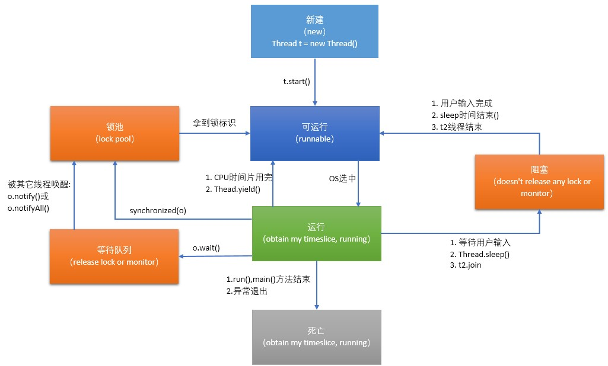

# C/C++多线程面试

## 概念题

### 线程的基本概念

线程，有时称为轻量级进程，是CPU使用的基本单元；它由线程ID、程序计数器、寄存器集合和堆栈组成。它与属于同一进程的其他线程共享其代码段、数据段和其他操作系统资源（如打开文件和信号）。

### 线程的基本状态

线程有五种状态：新建(new)、就绪(runnable)、运行(running)、阻塞(blocked)、死亡(dead)。

**新建（new）**：处于该状态的时间很短暂。已被分配了必须的系统资源，并执行了初始化。表示有资格获得CPU时间。调度器可以把该线程变为runnable或者blocked状态

**就绪（Runnable）**：这种状态下只要调度器把时间片分配给线程，线程就能运行。处在这种状态就是可运行可不运行的状态

**运行状态（Running）**：如果一个线程处于这个状态,那么它正在占用CPU,执行程序代码.只有处于就绪状态的线程才有机会转到运行状态.

**阻塞（Blocked）**：线程能够运行，但有个条件阻止它的运行。当线程处于阻塞状态时，调度器将会忽略线程，不会分配给线程任何CPU时间（例如sleep）。只有重新进入了就绪状态，才有可能执行操作。

​	阻塞状态可分为三种:

1. 位于对象**等待队列**中(in Object’s wait pool)当线程处于运行状态的时候,如果执行了某个对象的wait()方法,java虚拟机就会把这个线程放到这个对象的等待池中.这设计到线程通信的内容.
2. 位于对象**锁池**中(in Object’s lock pool)当线程处于运行状态时,试图获得某个对象的同步锁时,如果该对象的同步锁已经被其他线程占用,java虚拟机就会把这个线程放到这个对象从锁池中,这涉及到"线程同步"的内容
3. 其他**阻塞**状态(otherwise Blocked)当前线程执行了sleep（)方法,或者调用了其他线程的join()方法,或者发出了I/O请求时,就会进入这个状态.

**死亡（Dead）**：处于死亡状态的线程讲不再是可调度的，并且再也不会得到CPU时间。任务死亡的通常方式是从run()方法返回。

### 线程各状态之间的转换

### 线程与进程的区别

1.  线程是进程的一部分，所以线程有的时候被称为是轻权进程或者轻量级进程。
2. 一个没有线程的进程是可以被看作单线程的，如果一个进程内拥有多个进程，进程的执行过程不是一条线（线程）的，而是多条线（线程）共同完成的。
3. 系统在运行的时候会为每个进程分配不同的内存区域，但是不会为线程分配内存（线程所使用的资源是它所属的进程的资源），线程组只能共享资源。那就是说，除了CPU之外（线程在运行的时候要占用CPU资源），计算机内部的软硬件资源的分配与线程无关，线程只能共享它所属进程的资源。
4. 与进程的控制表PCB相似，线程也有自己的控制表TCB，但是TCB中所保存的线程状态比PCB表中少多了。
5. 进程是系统所有资源分配时候的一个基本单位，拥有一个完整的虚拟空间地址，并不依赖线程而独立存在。

### 线程同步互斥的4种方式

1. **临界区**（Critical Section）：通过对多线程的串行化来访问公共资源或一段代码，速度快，适合控制数据访问。在任意时刻只允许一个线程对共享资源进行访问，如果有多个线程试图访问公共资源，那么在有一个线程进入后，其他试图访问公共资源的线程将被挂起，并一直等到进入临界区的线程离开，临界区在被释放后，其他线程才可以抢占。
2. **互斥量**（Mutex）：采用互斥对象机制。 只有拥有互斥对象的线程才有访问公共资源的权限，因为互斥对象只有一个，所以能保证公共资源不会同时被多个线程访问。互斥不仅能实现同一应用程序的公共资源安全共享，还能实现不同应用程序的公共资源安全共享
3. **信号量**（Semaphore）：它允许多个线程在同一时刻访问同一资源，但是需要限制在同一时刻访问此资源的最大线程数目
4. **事 件**（Event）： 通过通知操作的方式来保持线程的同步，还可以方便实现对多个线程的优先级比较的操作

## 选择题

## 编程题

