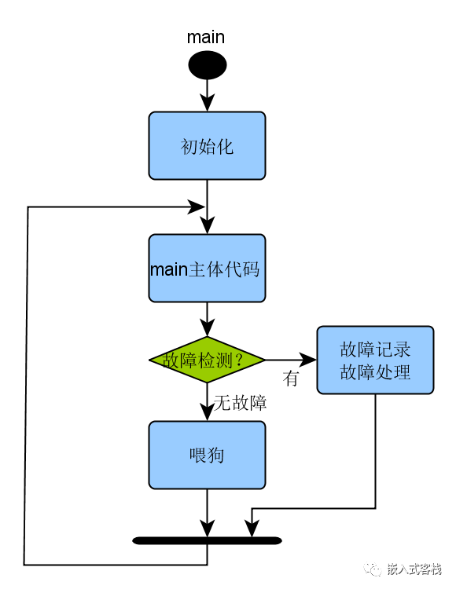
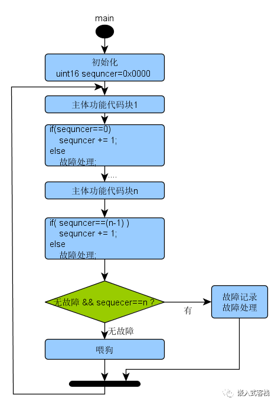
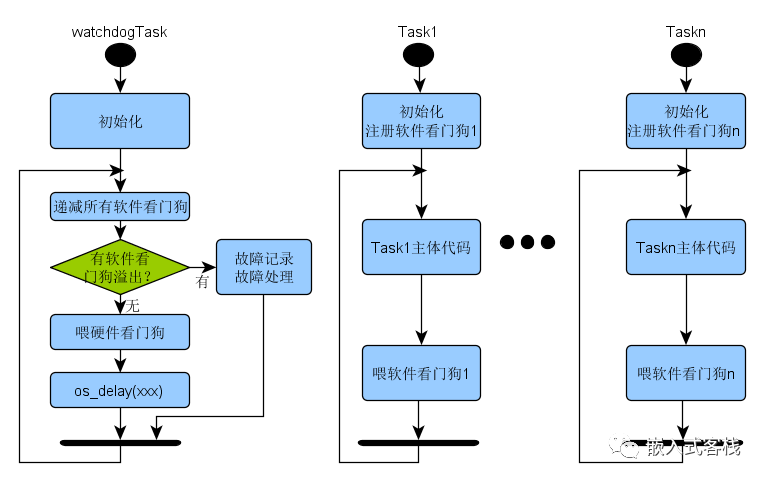

# 看门狗那些事

单片机程序写辣么多，看门狗狗天天见，你的狗狗养的对么？不停的喂狗，只要狗不叫就完了嘛？真是这样么？事实上可能不是你想的辣么简单.....

## 啥叫看门狗

看门狗也称为看门狗定时器，本质上是一种定时电路或者软件定时器机制。

### 工作原理

看门狗的硬件基础是一个计数器，该计数器被设置为某个定时初值，然后递减至零。软件负责经常将计数重置为其定时初值，以确保计数永远不会达到零。如果确实达到零，则意味着某种故障发生，该采取对应措施应对，或重启或进入失效安全状态，具体取决于系统的设计。

正常工作时，单片机、处理器或者线程，周期性重置看门狗定时器的定时值，定时器则在后台不断的计数，如果定时时间到了且没有再次喂狗，则狗叫，意味着一些不寻常的事情发生了！此时，狗狗对外发出指令，执行相应的动作。这里所谓的动作究竟是什么？取决于实际系统的设计。常见的看门狗芯片则会发出复位信号给单片机或者处理，对于软件定时器而言，具体会有何种动作，则灵活多变，具体取决于采用何种安全策略。

通俗讲也称为喂狗，这个定时值相当于狗粮，狗狗吃饱了，胃里不断消耗狗粮，如果在消耗完之前没有在喂狗粮，再狗狗饿得直叫唤，发出预警消息。反言之，一个一直正常工作的系统，其看门狗总是被喂养的很好，不会饿了狂叫。

注：看到有文章把重置看门狗定时器叫踢狗(kick watchdog)，嗯嗯，这不太好，要对狗狗好一点，不要踢，叫喂吧～～～

看门狗机制在电子系统中作用非常之重要，这里举个极端的栗子，火星车如果程序挂了，就相当于失联，如果没有看门狗电路。你想象一下是什么场景，无法通讯无法唤醒，秒变太空垃圾～～～

## 能看住哪些错误呢？

- 栈或堆溢出，程序跑飞
- 某段程序异常无法返回或陷入死循环
- 强电磁干扰破坏数据导致系统异常，这你或许不好理解，你就想象一下军事领域，或者航空航天领域很多电子系统，常工作在强电磁干扰环境中
- bug导致的系统宕机
- 多任务系统中死锁
- ......

原因万万千，憋慌！你还有个好狗狗在帮你，让看门狗来收拾残局吧。在一个复杂的嵌入式系统中，不可能保证没有bug，但是通过使用看门狗，您可以保证没有任何bug会无限期地挂起系统。

## 狗叫后该咋整？

常见的处理策略有哪些呢？

- **系统复位**，大多数人都有的体验，系统挂了咋整，重启。

- **失效安全**，老外常叫fail-safe 模式。就是设备即使出现致命故障了，也别造成安全事故。粗鲁点说，就是挂了，也不要影响他人。不易理解，举个例子，一个正在下降的电梯，加入看门狗检测到程序异常了，安全的做法是赶紧停止电机转动，否则自由落体，就要凉凉啦。这在IEC61508 功能安全标准，或者医疗安全标准、汽车安全标准中都有体现。

- **一种推荐做法**, 芯片复位后，利用芯片复位状态寄存器值，对看门狗复位事件计数，事不过三，如果连续三次此类复位，则保守做法就是将系统切换到安全状态或显示错误消息，这样可以避免无限重新启动。怎么做呢？以IAR为例，可以定义一个变量不让系统自动初始化（如IAR中叫,__no_init)，实现计数，复位后其值仍然保存，除非断电。

- ....取决于具体的设计策略

如果我们希望系统快速恢复，应该采用看门狗复位后的初始化比正常加电初始化短的策略。也就是说跳过设备的一些自检。当然，在某些系统中最好进行全面自检，因为看门狗超时的根本原因可能是通过此类硬件异常导致的。

## 具体咋喂狗呢？

对于裸机程序而言，推荐下面两种处理策略：故障检测式喂狗，故障检测加强式喂狗。

### 故障检测式喂狗

对于一个裸奔单片机程序而言，可以在喂狗时同时检测一些关键的运行时状态，比如栈深度、缓冲区、关键功能链的硬件（如传感器、执行机构等）,如这些状态异常，则记录错误状态，将设备至于功能安全状态。

### 故障检测加强式喂狗

啥叫序列检测式喂狗呢？IEC-61508中有种范式叫sequence check,有点邪乎？看下图，你就马上明了了。

将main函数的主体关键功能块，设置一个序列标记，如果如果序列出错就做安全故障处理，正确则继续下一块的执行。在喂狗的时候，看下序列是否正确，正确就喂，否则就做错误处理，或者干脆让狗叫也是一种方式。

对于多任务实时系统而言，有这样一些不一样的需求：

- 检测操作系统是否正确运行
- 在所有任务中检测是否有死循环
- 检测涉及两个或多个任务的死锁
- 检测由于高优先级任务占用CPU而导致某些低优先级任务无法运行
- ....

### 母狗带群仔喂狗法

上图解释：

**实现策略描述**：

watchdogTask可看成狗窝，里面住了一群狗，其中硬件看门狗是母狗，子任务软件看门狗为小狗仔。每个子任务需要在每一个loop循环喂一次狗（当然实际实现时也可以加入任务故障检测式喂狗），在watchdogTask每一个循环都对所有软件看门狗递减，如果溢出则软狗叫了，需要做异常处理（复位或进入失效安全模式）。如果所有的软件狗都没有溢出，则喂硬件看门狗（可能是单片机内置或外置芯片）

实际实现时须注意：

- watchdogTask应选取最高优先级
- 每个loop应调用os_delay一定时间，以出让CPU时间给其他task运行。挂起的时间应小于最大硬件看门狗延时时间。
- 须合理安排各任务的优先级
- 严禁在中断处理中以及其他函数中私自喂狗。

## 狗多久叫合理呢?

### 过短之痛

看门狗定时器定时时间设置过短，则系统容易误判，可能会导致频繁复位或进入失效安全模式。因为任何一条安全链的好坏取决于它最薄弱的一环，如果选择一个太短的超时间隔。固件的循环时间是动态的，尤其外部的异步事件比较多，或者有中断嵌套的情况，则波动会比较大，所以需要考虑最坏情况，系统循环一次要多久。

### 过长之害

一种方法是选择一个几秒钟长的间隔。当您仅尝试复位一个确实挂起的系统，但不希望对系统的时间进行详细研究时，可以采用此策略。这是一个健壮的方法。但有些系统需要快速恢复，这就造成故障诊断过慢的危害了，尤其在一些对安全要求极高的场合，比如核电系统，汽车电子系统、医疗器械系统等等。

所以实际设计时需要兼顾最坏情况下，尽量选择相对较短的定时时长，在两者中寻找一个平衡。

## 总结

于单片机编程而言，其实对嵌入式Linux甚至在数据库中，看门狗策略都有大量的应用，如何合理的使用看门狗，对于设计一个健壮的电子系统而言是非常重要的一个话题。