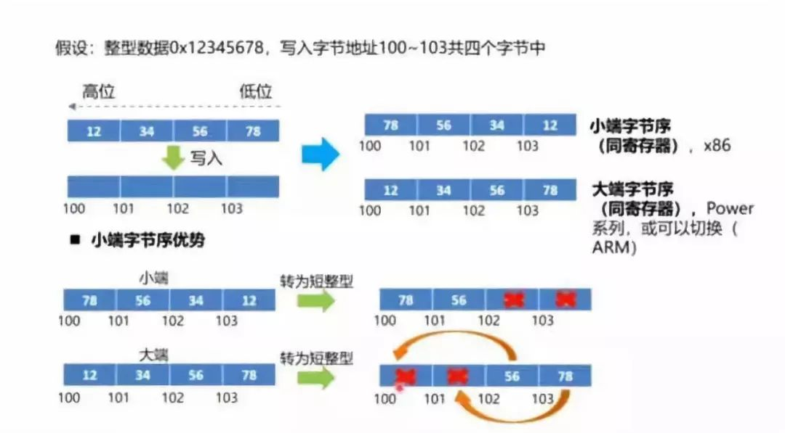
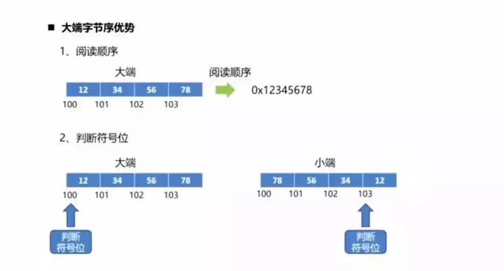
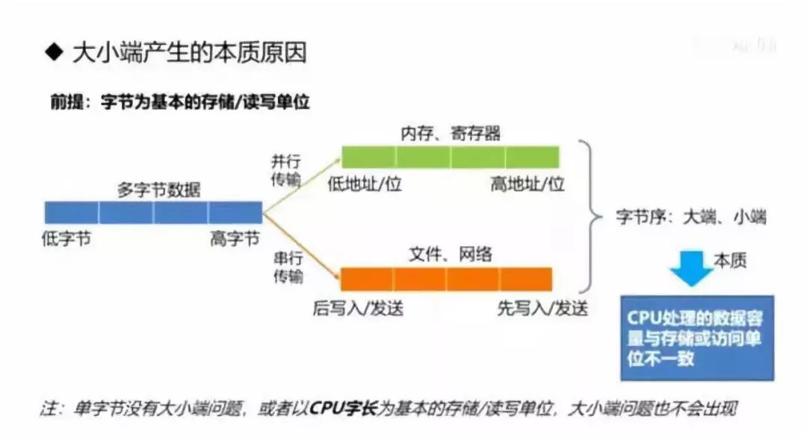

# 大端模式和小端模式

## 字节序

字节顺序，又称端序或尾序（Endianness）。在计算机科学领域中，是跨越多字节的程序对象的存储规则。

在几乎所有的机器上，多字节对象都被存储为连续的字节序列。

*数据* ：高位→低位，如0x04030201，04是高位，01是低。

*内存* ：低地址→高地址，如0x00000000→0xFFFFFFFF。

另外，计算机是按字长（如32位、64位）来访问内存数据的，而内存是按字节为单位来存储和编址的。

对于32位机，int = 0x04030201需要4个字节来存储，首字节（低地址）是存储04还是01呢？存储04（高位）的称为大端CPU，存储01（低位）的称为小端CPU。

### 大端与小端

在计算机中一般讲字节序分为两类：Big-Endian和 Little-Endian:

1. Big-Endian    高位字节在前，低位字节在后。这是人类读写数值的方法。
2. Little-Endian 低位字节在前，高位字节在后。
3. 网络字节序：TCP/IP各层协议将字节序定义为Big-Endian，因此TCP/IP协议中使用的字节序通常称之为网络字节序。

### 为什么会小端有字节序

计算机电路先处理低位字节，效率比较高，因为计算都是从低位开始的。所以，计算机的内部处理都是小端字节序。

但是，人类还是习惯读写大端字节序。所以，除了计算机的内部处理，其他的场合几乎都是大端字节序，比如网络传输和文件储存。

计算机处理字节序的时候，不知道什么是高位字节，什么是低位字节。它只知道按顺序读取字节，先读第一个字节，再读第二个字节。

如果是大端字节序，先读到的就是高位字节，后读到的就是低位字节。小端字节序正好相反。

理解这一点，才能理解计算机如何处理字节序。

### 总结

字节序的处理，就是一句话：

> "只有读取的时候，才必须区分字节序，其他情况都不用考虑。"

处理器读取外部数据的时候，必须知道数据的字节序，将其转成正确的值。然后，就正常使用这个值，完全不用再考虑字节序。

即使是向外部设备写入数据，也不用考虑字节序，正常写入一个值即可。外部设备会自己处理字节序的问题。

### 字节序转换

```C
#include <stdio.h>
#include <netinet/in.h>

int main()
{
    int i_num = 0x12345678;
    printf("[0]:0x%x\n", *((char *)&i_num + 0));
    printf("[1]:0x%x\n", *((char *)&i_num + 1));
    printf("[2]:0x%x\n", *((char *)&i_num + 2));
    printf("[3]:0x%x\n", *((char *)&i_num + 3));

    i_num = htonl(i_num);
    printf("[0]:0x%x\n", *((char *)&i_num + 0));
    printf("[1]:0x%x\n", *((char *)&i_num + 1));
    printf("[2]:0x%x\n", *((char *)&i_num + 2));
    printf("[3]:0x%x\n", *((char *)&i_num + 3));

    return 0;
}
```

在80X86CPU平台上，执行该程序得到如下结果：

> \[0]:0x78 \
> \[1]:0x56 \
> \[2]:0x34 \
> \[3]:0x12
>
> \[0]:0x12 \
> \[1]:0x34 \
> \[2]:0x56 \
> \[3]:0x78

分析结果，在80X86平台上，系统将多字节中的低位存储在变量起始地址，使用小端法。htonl将i_num转换成网络字节序，可见网络字节序是大端法。

## 大端、小端字节序各自优势

### 小端字节序优势



### 大端字节序优势



### 大小端产生的本质原因

