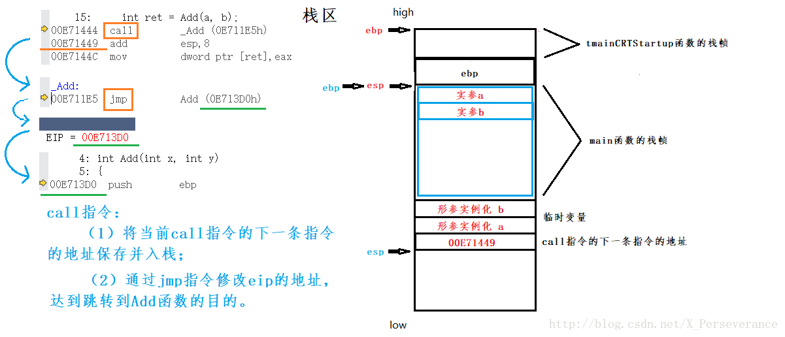

# 深入理解函数栈帧(Stack Frame)

## 什么是栈?

在数据结构中, 栈(Stack)是限定仅在表尾进行插入或删除操作的线性表。栈是一种数据结构，它按照后进先出的原则存储数据，先进入的数据被压入栈底，最后的数据在栈顶，需要读数据的时候从栈顶开始弹出数据。

在计算机系统中，栈也可以称之为栈内存是一个具有动态内存区域,存储函数内部（包括main函数）的局部变量和方法调用和函数参数值，是由系统自动分配的，一般速度较快；存储地址是连续且存在有限栈容量，会出现溢出现象。程序可以将数据压入栈中，也可以将数据从栈顶弹出。压栈操作使得栈增大，而弹出操作使栈减小。

栈用于维护函数调用的上下文，离开了栈函数调用就没法实现。

## 什么是栈帧(Stack Frame)?

每一次函数的调用,都会在调用栈(call stack)上维护一个独立的栈帧(stack frame).

每个独立的栈帧一般包括:

* 函数的返回地址和参数

* 临时变量: 包括函数的非静态局部变量以及编译器自动生成的其他临时变量

* 函数调用的上下文

    栈是从高地址向低地址延伸,一个函数的栈帧用ebp 和 esp 这两个寄存器来划定范围.ebp 指向当前的栈帧的底部,esp 始终指向栈帧的顶部;

    （1）ESP：栈指针寄存器(extended stack pointer)，其内存放着一个指针，该指针永远指向系统栈最上面一个栈帧的栈顶。
    （2）EBP：基址指针寄存器(extended base pointer)，其内存放着一个指针，该指针永远指向系统栈最上面一个栈帧的底部。


在函数调用的过程中,有函数的调用者(caller)和被调用的函数(callee).

调用者需要知道被调用者函数返回值;

被调用者需要知道传入的参数和返回的地址;

## 函数调用

函数调用分为以下几步:

* 参数入栈: 将参数按照调用约定(C 是从右向左)依次压入系统栈中;
* 返回地址入栈: 将当前代码区调用指令的下一条指令地址压入栈中，供函数返回时继续执行;
* 代码跳转: 处理器将代码区跳转到被调用函数的入口处;
* 栈帧调整:
    1. 将调用者的ebp压栈处理，保存指向栈底的ebp的地址（方便函数返回之后的现场恢复），此时esp指向新的栈顶位置； **push ebp**
    2. 将当前栈帧切换到新栈帧(将eps值装入ebp，更新栈帧底部), 这时ebp指向栈顶，而此时栈顶就是old ebp  **mov ebp, esp**
    3. 给新栈帧分配空间 **sub esp, XXX**

## 函数返回

函数返回分为以下几步:

* 保存被调用函数的返回值到 eax 寄存器中 mov eax, xxx
* 恢复 esp 同时回收局部变量空间 mov ebp, esp
* 将上一个栈帧底部位置恢复到 ebp pop ebp
* 弹出当前栈顶元素,从栈中取到返回地址,并跳转到该位置 ret

到这里栈帧以及函数的调用与返回已经结束了,这里涉及一些汇编的知识,这里还没有记录不同平台的调用约定和一些特殊的寄存器.

## 举个栗子

```C
#include <stdio.h>
#include <windows.h>

int Add(int x, int y)
{
      int z = 0;
      z = x + y;
      return z;
}

int main()
{
      int a = 10;
      int b = 20;
      int ret = Add(a, b);
      printf("a+b=%d\n", ret);
      system("pause");
      return 0;
}
```





函数调用完成后，释放栈帧，以上就是函数的整个调用过程。
