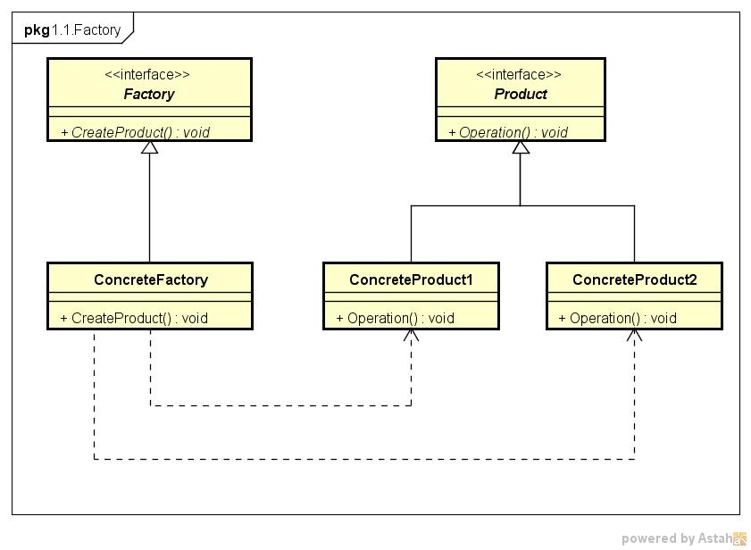

# Factory Method

参考： https://www.jianshu.com/p/e55fbddc071c

工厂模式实现了创建者和调用者的分离

## 为什么需要Factory Method

很多人都会纠结“既然有了构造函数，何必再折腾那么多事情呢”。为了解答这个问题，需要先解释一下构造函数是干什么用的。

最早的C语言，需要按照如下的方式创建资源：

```c
some_strcut *p = (some_struct*)malloc(sizeof(some_struct));
inti_some_struct(p);
do_something(p);
```

即分配内存 -> 初始化 -> 使用。

在OOP的时代，创建对象是很频繁的事情。同时，一个没有初始化的数据结构是无法使用的。因此，构造函数被发明出来，将分配内存+初始化合并到了一起。

C++中，变成了下面的样子：

```cpp
SomeClass *p = new SomeClass();
p.do_something();
```

但是，构造函数完成的工作从更高层的代码设计角度还是太过于初级。因此复杂的创建逻辑还是需要写代码来控制。所以还是需要：

```cpp
Some Class * createSomeClass(...) {
	// 做一些逻辑
	SomeClass * p = newSomeClass();  // 或者复用已有的对象
	// 再做一些额外的初始化
	return p;
}
```

这就是Factory Method的雏形。

Factory Method要解决的问题是：**希望能够创建一个对象，但创建过程比较复杂，希望对外隐藏这些细节。**

请特别留意“**创建过程比较复杂**”这个条件。如果不复杂，用构造函数就够了。比如想用一个HashMap时也要搞一个factory,这就很中2了。

那么什么是“复杂的创建过程”呢？ 举几个栗子：

**例子1：** 创建对象可能是一个pool里的，不是每次都凭空创建一个新的。而pool的大小等参数可以通过另外的逻辑去控制。比如连接池对象，线程池对象就是很好的例子。

**例子2：** 对象代码的作者希望隐藏对象真实的类型，而构造函数一定要真实的类名才能用。比如作者提供了：

```cpp
class Foo {
	// ...
}
```

而真实的实现类是：

```cpp
class FooImplV1 : public Foo {
	// ...
}
```

但是他不希望你知道FooImplV1的存在（没准下次就改成V2了），只希望你知道Foo, 所以他必须提供某种类似于这样的方法让你用：

```cpp
Foo * foo = FooCreater.create();
foo->do_something();
```

**例子3：** 对象创建时会有很多参数来决定如何创建出这个对象。比如你有一个数据写在文件里，可能是xml也可能是json。这个文件的数据可以变成一个对象，大概就可以搞成：

```cpp
Foo* foo = FooCreater.createFromFile("/path/to/the/data-file.ext");
```

再比如这个文件时描述一个可以显示在浏览器的UI的基础数据。而不同浏览器可以正确显示的需要的数据不太一样。这个“不一样”可以表达为：

```cpp
Foo* foo = FooCreater.createFromFile("/path/to/the/data-file.ext", BrowserType.CHROME);
```

这里第二个参数“BrowserType”是一个枚举，表示如何去生成指定要求的对象。所以这个createFromFile内部可能是：

```cpp
Foo* FooCreater::createFromFile(String path, BrowserType type) {
    byte[] bytes = Files.load(path);
	switch(type) {
	case CHROME:
		return new FooChromeImpl(bytes);
	case IE:
		return new FooIE8V1Impl(bytes);
	// ...
	}
}
```

当然，实际场景可能会复杂得多，会有大量的配置参数。

```cpp
Foo* foo = FooCreater.createFromFile("...", param1, param2, param3, ...);
```

如果需要，可以帮params弄成一个Config对象。而如果这个Config对象也很复杂，也许还得给Config弄个Factory。如果Factory本身的创建也挺复杂呢？嗯，弄个Factory的Factory。

**例子4：** 简化一些常规的创建过程。上面可以看到根据配置去创建一个对象也很复杂。但可能95%的情况我们就创建某个特定类型的对象。这时可以弄个函数直接省略那些配置过程。纯粹就是为了方便。

```cpp
Foo* foo = FooCreater.createFromFile("/path/to/the/data-file.ext");
```

**例子5:** 创建一个对象有复杂的依赖关系，比如Foo对象的创建依赖A，A又依赖B，B又依赖C……。于是创建过程是一组对象的的创建和注入。手写太麻烦了。所以要把创建过程本身做很好地维护。

**例子6:** 你知道怎么创建一个对象，但是无法把控创建的时机。你需要把“如何创建”的代码塞给“负责什么时候创建”的代码。后者在适当的时机，就回调创建的函数。

**例子7:** 避免在构造函数中抛出异常。"构造函数里不要抛出异常"这条原则很多人都知道。不在这里展开讨论。但问题是，业务要求必须在这里抛一个异常怎么办？就像上面的Foo要求从文件读出来数据并创建对象。但如果文件不存在或者磁盘有问题读不出来都会抛异常。因此用FooCreator.createFromFile这个工厂来搞定异常这件事。

其实还有很多例子，就不继续扩展了。要点是，当你有任何复杂的的创建对象过程时，你都需要写一个某种createXXXX的函数帮你实现。再拓展一下范围，哪怕创建的不是对象，而是任何资源，也都得这么干。

一句话：**不管你用什么语言，创建什么资源。当你开始为“创建”本身写代码的时候，就是在使用“工厂模式”了。**

**请总是使用可以满足需求的最简单的方案。** 不要为了工厂模式而工厂模式。搞工厂这么一套（或者任何其他模式）都是有成本的。开闭原则是没错，但只应该在合适的时候使用。更麻烦的是假如你一开始搞错了，做出来的工厂的接口抽象后来发现是不符合需求变更，改起来还不如一开始没有做工厂，直接new。越简单的代码越容易改，哪怕看起来会有些体力劳动，但不费神。当然，这也不是说尽量不要用模式。这完全取决于你对需求的理解。所以多花时间理解需求和业务，然后问自己“这里可能会变得很复杂吗？这里未来有多大可能需要扩展？”

## 简单工厂模式(Simple Factory)

简单工厂模式又叫静态方法模式（因为工厂类定义了一个静态方法）

现实生活中，工厂是负责生产产品的；同样在设计模式中，简单工厂模式我们可以理解为负责生产对象的一个类，称为“工厂类”。

### 使用场景

将“类实例化的操作”与“使用对象的操作”分开，让使用者不用知道具体参数就可以实例化出所需要的“产品”类，从而避免了在客户端代码中显式指定，实现了解耦。

即使用者可直接消费产品而不需要知道其生产的细节.

### 模式组成

|组成(角色)|关系|作用|
|:--|:--|:--|
|抽象产品(Product)|具体产品的父类|描述产品的公共接口|
|具体产品(ConcreteProduct)|抽象产品的子类；工厂类创建的目标类|描述生产的具体产品|
|工厂(Factory)|被外界调用|根据传入不同参数而创建不同具体产品类的实例|

### 类图


### 实例

* 背景：小成有一个塑料生产厂，用来做塑料加工生意
* 目的：最近推出了3个产品，小成希望使用简单工厂模式实现3款产品的生产

*步骤1.* 创建抽象产品类，定义具体产品的公共接口

```cpp
class Product
{
public:
    virtual void show() = 0;
};
```

*步骤2.*  创建具体产品类（继承抽象产品类），定义生产的具体产品

```cpp
//具体产品类A
class  ProductA : public  Product
{
public:
     void Show() {
        std::cout << "生产出了产品A" << std::endl;
    }
};

//具体产品类B
class  ProductB : public  Product
{
public:
     void Show() {
        std::cout << "生产出了产品B" << std::endl;
    }
};

//具体产品类C
class  ProductC : public  Product
{
public:
     void Show() {
        std::cout << "生产出了产品C" << std::endl;
    }
};
```

*步骤3.* 创建工厂类，通过创建静态方法从而根据传入不同参数创建不同具体产品类的实例

```cpp
class  Factory
{
public:
    Product* Manufacture(std::string ProductName)
    {
        //工厂类里用switch语句控制生产哪种商品；
        //使用者只需要调用工厂类的静态方法就可以实现产品类的实例化。
        switch (ProductName){
            case "A":
                return new ProductA();

            case "B":
                return new ProductB();

            case "C":
                return new ProductC();

            default:
                return NULL;

        }
    }
}；
```

*步骤4.* 外界通过调用工厂类的静态方法，传入不同参数从而创建不同具体产品类的实例

```cpp
int main()
{
    Factory* mFactory = new Factory();

    //客户要产品A
    //调用工厂类的方法 & 传入不同参数从而创建产品实例
    Product *productA = mFactory->Manufacture("A")
    if (NULL != productA)
    {
        productA->Show();
        delete productA;
    }

    //客户要产品B
    Product *productB = mFactory->Manufacture("B")
    if (NULL != productB)
    {
        productB->Show();
        delete productB;
    }

    //客户要产品C
    Product *productC = mFactory->Manufacture("B")
    if (NULL != productC)
    {
        productC->Show();
        delete productC;
    }


    return 0;
}
```

### 问题

* 工厂类集中了所有实例（Product）的创建逻辑，一旦这个工厂不能正常工作，整个系统都会受到影响；
* 违背“开放 - 关闭原则”，一旦添加新产品就不得不修改工厂类的逻辑，这样就会造成工厂逻辑过于复杂。
* 简单工厂模式由于使用了静态工厂方法，静态方法不能被继承和重写，会造成工厂角色无法形成基于继承的等级结构。

## 工厂模式(Factory)

定义创建对象的接口，并且让子类决定实例化哪一个类，使一个类的实例化延迟到其子类。

